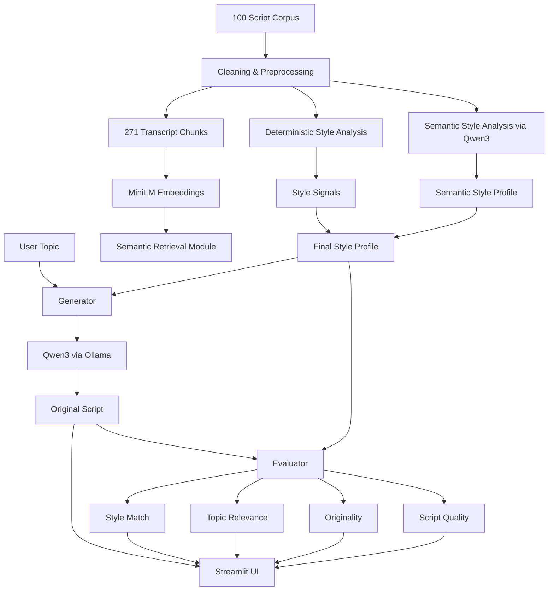

# ScriptMaster

ScriptMaster is a local AI script-generation system that studies a corpus of scripts, extracts reusable style patterns, and generates new spoken scripts from a single topic input.

## Core idea

**Input:** one topic  
**Output:** an original script + optional evaluation

The development corpus contained **100 scripts**, approximately **25K words**, and produced **271 semantic retrieval chunks**.

## Tech stack

- Python
- Ollama
- Qwen3
- Sentence Transformers
- all-MiniLM-L6-v2
- NumPy
- Streamlit
- Local semantic search
- Prompt engineering
- Style analysis
- Originality checks

## What the system does

1. Cleans and analyzes the transcript corpus.
2. Extracts deterministic style signals such as sentence length, question frequency, pronoun usage, recurring transitions, and pacing.
3. Uses a local Qwen model through Ollama to infer higher-level style characteristics such as hook type, tone, rhetorical devices, structure, explanation style, and ending patterns.
4. Builds semantic embeddings with MiniLM for corpus exploration and similarity search.
5. Generates a new script locally from a single topic using the learned style profile.
6. Evaluates the generated script for style alignment, topic relevance, originality, and script quality.
7. Exposes the workflow through a Streamlit UI.

## Important architecture decision

An earlier version passed raw retrieved transcript chunks directly into the generation prompt.

Testing showed a failure mode: the model could follow the **content of the retrieved examples** instead of the user's topic.

The final generator therefore separates:

- **Topic = content**
- **Style profile = writing behaviour**

Raw transcript content is no longer passed into the production generation prompt. The semantic retrieval system remains part of the project because it was built and tested for corpus exploration and RAG experiments.

## Architecture



## Project structure

```text
ScriptMaster/
├── app.py
├── scriptmaster_local.py
├── scriptmaster_evaluator.py
├── local_style_analyzer.py
├── local_retriever.py
├── requirements.txt
├── README.md
├── ARCHITECTURE.md
├── .gitignore
└── data/
    └── processed/
```

## Setup

Install Ollama, then:

```bash
ollama pull qwen3:4b
```

Install Python dependencies:

```bash
python -m pip install -r requirements.txt
```

Run the app:

```bash
python -m streamlit run app.py
```

## Evaluation

The evaluator measures:

- Style Match
- Topic Relevance
- Originality
- Script Quality
- Long phrase overlap
- Word count
- Sentence count
- Average sentence length
- Question frequency
- First/second-person usage

The LLM score is treated as a heuristic, not objective ground truth.

## Engineering lessons

- Local LLMs can replace paid APIs when cost matters.
- Retrieval can improve relevance, but raw retrieved content can also contaminate generation.
- Style conditioning works better when content and style are explicitly separated.
- AI output needs validation instead of blind trust.
- Local inference speed is a real product constraint.
- UI responsiveness improves when generation and evaluation are separate actions.

## Future improvements

- faster model benchmarking
- multiple selectable style profiles
- configurable script length
- stronger topic-drift testing
- factual research grounding
- export to DOCX/PDF
- regression tests


## Demo

### ScriptMaster Interface


### Generated Script & Evaluation


## Demo

### ScriptMaster Interface


### Generated Script


